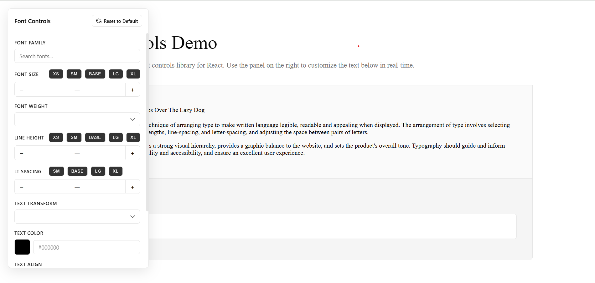

# Font Controls

A beautiful, Leva-inspired font controls library for React. Provides an intuitive GUI panel for adjusting typography settings in real-time.

  

## Features

**- 100 Google Fonts**  
**- Draggable Panel**  
**- CSS Isolated**  
**- Copy Paste Your Text Instantly**

## Screenshot



## Installation

```bash
npm install font-controls
```

## Quick Start

```tsx
import { FontControls, useFontControls } from "font-controls";
import "font-controls/dist/style.css";

function App() {
  const { config, setConfig } = useFontControls();

  return (
    <div>
      <div style={config}>
        <h1>Your styled text here</h1>
        <p>Typography controls made easy!</p>
      </div>

      <FontControls value={config} onChange={setConfig} />
    </div>
  );
}
```

**That's it!** Google Fonts are loaded automatically.

## Complete Example

Here's a full example with live preview:

```tsx
import { FontControls, useFontControls } from "font-controls";
import "font-controls/dist/style.css";

function App() {
  const { config, setConfig } = useFontControls();

  return (
    <div style={{ minHeight: "100vh", padding: "40px" }}>
      <div style={{ maxWidth: "1200px", margin: "0 auto" }}>
        <h1>Font Controls Demo</h1>

        {/* Preview area with live font changes */}
        <div
          style={{
            ...config,
            padding: "40px",
            border: "1px solid #eee",
            borderRadius: "8px",
          }}
        >
          <h2>The Quick Brown Fox Jumps Over The Lazy Dog</h2>
          <p>
            Typography is the art and technique of arranging type to make
            written language legible, readable and appealing when displayed.
          </p>
        </div>

        {/* Current config display */}
        <pre
          style={{
            background: "#f5f5f5",
            padding: "20px",
            borderRadius: "6px",
            marginTop: "20px",
          }}
        >
          {JSON.stringify(config, null, 2)}
        </pre>
      </div>

      {/* Font Controls Panel */}
      <FontControls value={config} onChange={setConfig} />
    </div>
  );
}
```

## API Reference

### `useFontControls` Hook

The easiest way to use font controls:

```tsx
const { config, setConfig, updateConfig, resetConfig } =
  useFontControls(initialConfig);
```

**Returns:**

- `config` - Current font configuration object
- `setConfig` - Set entire config at once
- `updateConfig` - Update a single property
- `resetConfig` - Reset to defaults

### `<FontControls>` Component

| Prop           | Type                           | Default                    | Description                     |
| -------------- | ------------------------------ | -------------------------- | ------------------------------- |
| `value`        | `Partial<FontConfig>`          | -                          | Current font configuration      |
| `onChange`     | `(config: FontConfig) => void` | -                          | Called when config changes      |
| `fontFamilies` | `string[]`                     | `['Inter', 'Roboto', ...]` | Custom font list (100 defaults) |
| `minFontSize`  | `number`                       | `8`                        | Minimum font size               |
| `maxFontSize`  | `number`                       | `120`                      | Maximum font size               |
| `fontSizeStep` | `number`                       | `1`                        | Font size increment             |

### `FontConfig` Type

```typescript
interface FontConfig {
  fontFamily: string;
  fontSize: number;
  fontWeight: number;
  lineHeight: number;
  letterSpacing: number;
  textTransform: "none" | "uppercase" | "lowercase" | "capitalize";
  color: string;
  textAlign: "left" | "center" | "right" | "justify";
}
```

## Advanced Usage

### Custom Font List

```tsx
<FontControls
  value={config}
  onChange={setConfig}
  fontFamilies={["Inter", "Roboto", "Playfair Display", "Fira Code"]}
/>
```

### Without the Hook

```tsx
import { useState } from "react";
import { FontControls } from "font-controls";

function App() {
  const [config, setConfig] = useState({});

  return <FontControls value={config} onChange={setConfig} />;
}
```

### Update Single Property

```tsx
const { config, updateConfig } = useFontControls();

// Update just the font size
updateConfig("fontSize", 24);

// Update just the color
updateConfig("color", "#ff0000");
```

## Styling

The library uses CSS variables for theming:

```css
:root {
  --fc-bg: hsl(0, 0%, 100%); /* Panel background */
  --fc-text: hsl(0, 0%, 3.9%); /* Text color */
  --fc-border: hsl(0, 0%, 89.8%); /* Border color */
  --fc-accent: hsl(0, 0%, 9%); /* Accent color */
}
```

### CSS Isolation

✅ **No conflicts** - All styles are scoped to `.font-controls-panel`  
✅ **Safe to use** - Won't affect your existing CSS  
✅ **No global resets** - Your layout stays intact

## Browser Support

- Chrome (latest)
- Firefox (latest)
- Safari (latest)
- Edge (latest)

## License

MIT

## Credits

Inspired by [Leva](https://github.com/pmndrs/leva)
