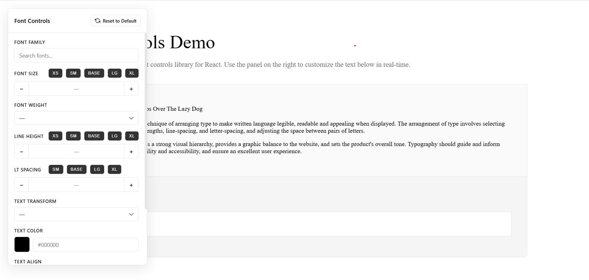

# Font Controls

A lightweight, beautiful, Leva-inspired font controls library for React. Provides an intuitive GUI panel for adjusting typography settings in real-time.

   

## Features

- **Lightweight & Fast:** ~10kB gzipped, zero heavy dependencies.
- **100+ Google Fonts:** Auto-loads fonts on the fly.
- **Draggable Panel:** Floating GUI that stays out of your way.
- **CSS Isolated:** Won't conflict with your app's styles (Tailwind, CSS Modules, etc.).
- **Export Config:** Instantly copy/paste the generated React styles, CSS classes, or HTML imports.

## Screenshot



## Installation

```bash
npm install font-controls
```

## Quick Start

```tsx
import { FontControls, useFontControls } from "font-controls";
import "font-controls/dist/style.css";

function App() {
  // 1. Get the current typography config
  const { config, setConfig } = useFontControls();

  return (
    <div>
      {/* 2. Apply config directly to the style prop */}
      <div style={config}>
        <h1>Your styled text here</h1>
        <p>Typography controls made easy!</p>
      </div>

      {/* 3. Render the floating GUI */}
      <FontControls value={config} onChange={setConfig} />
    </div>
  );
}
```

## API Reference

### `useFontControls(initialConfig?)` Hook

The easiest way to integrate font controls into your state.

**Returns:**

- `config` - The processed style object ready to be passed to `style={config}`.
- `setConfig` - Function to overwrite the entire config.
- `updateConfig` - Function to update a single property (e.g., `updateConfig('fontSize', 24)`).
- `resetConfig` - Reset to inheritance defaults.

### `<FontControls>` Component

| Prop           | Type                           | Default               | Description                               |
| -------------- | ------------------------------ | --------------------- | ----------------------------------------- |
| `value`        | `Partial<FontConfig>`          | -                     | The current configuration object          |
| `onChange`     | `(config: FontConfig) => void` | -                     | Callback fired on style changes           |
| `fontFamilies` | `string[]`                     | `[100 curated fonts]` | Custom font list to populate the dropdown |
| `minFontSize`  | `number`                       | `8`                   | Minimum allowed font size                 |
| `maxFontSize`  | `number`                       | `120`                 | Maximum allowed font size                 |

## License

MIT
